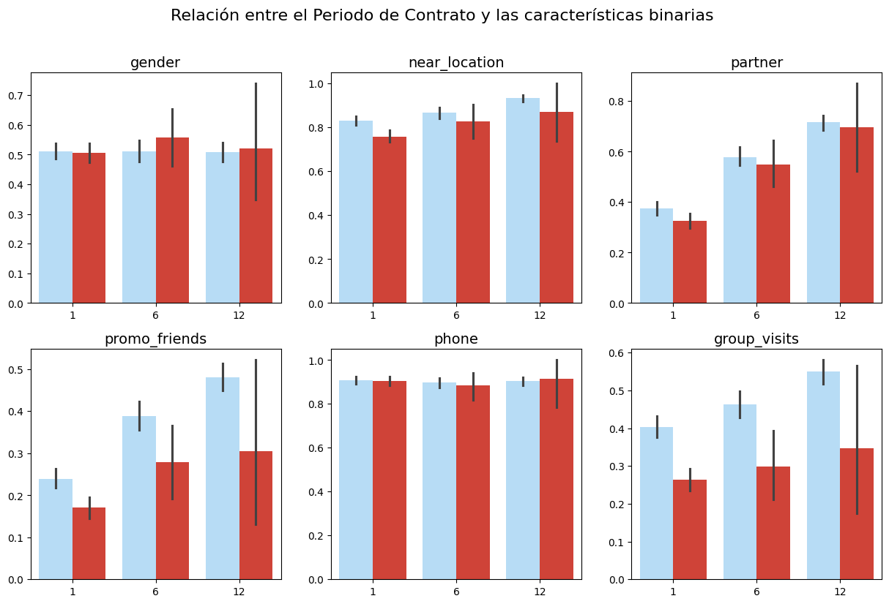
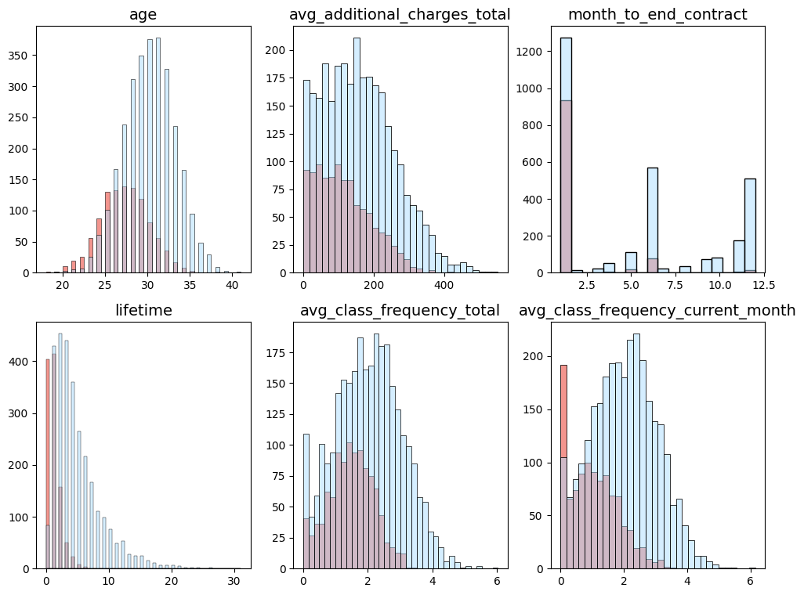
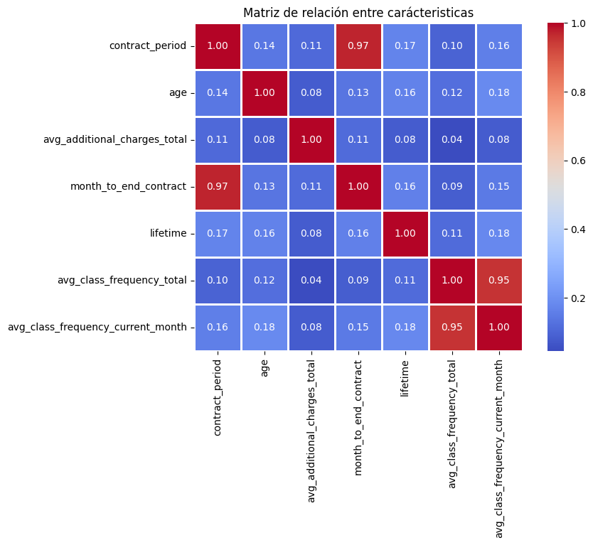
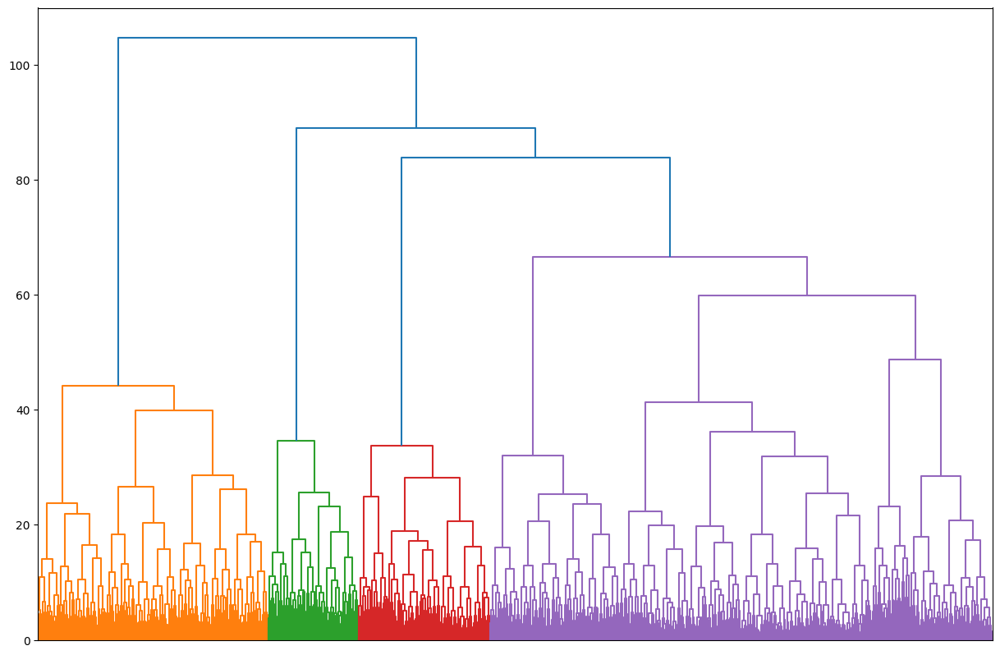
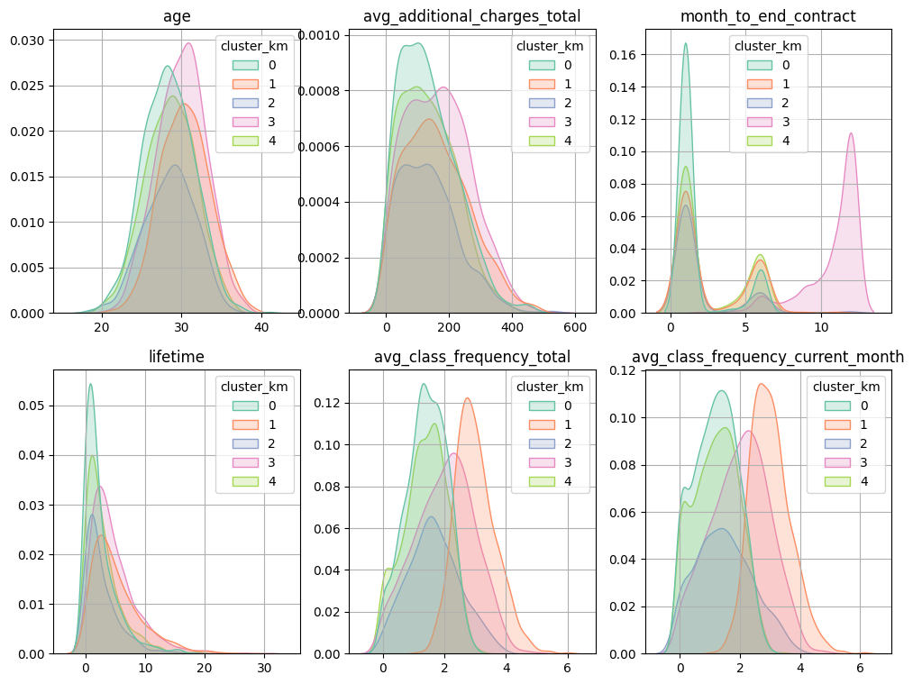
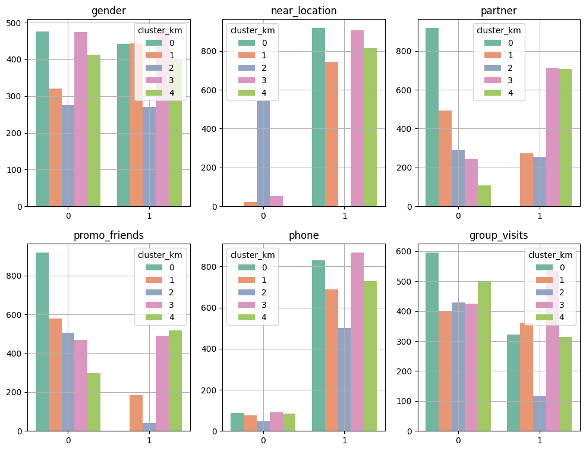
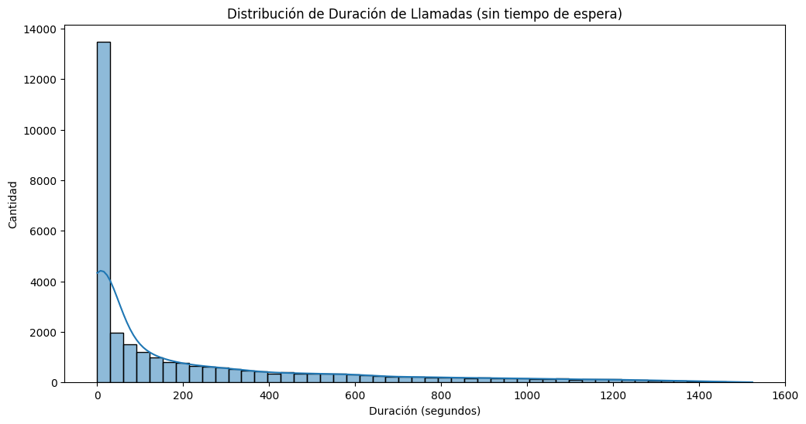
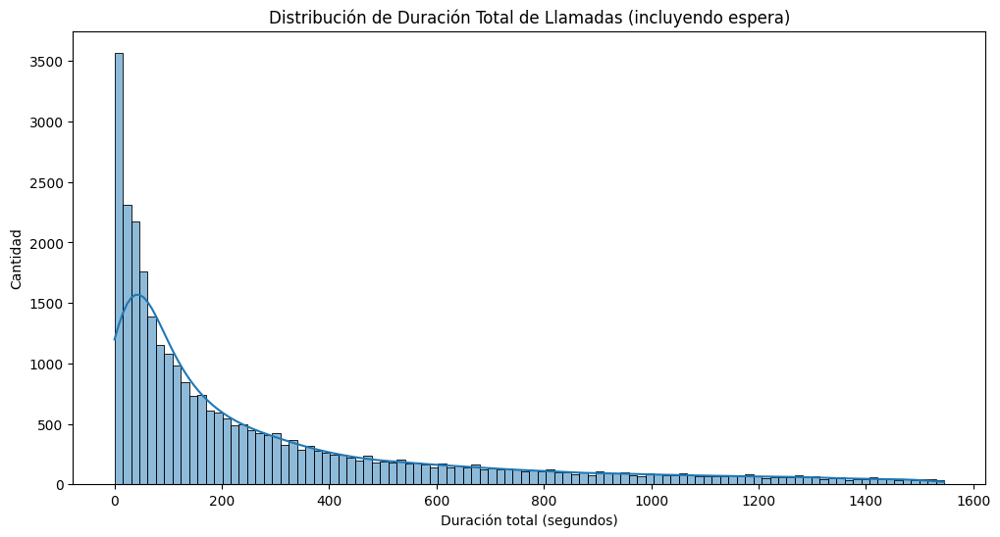
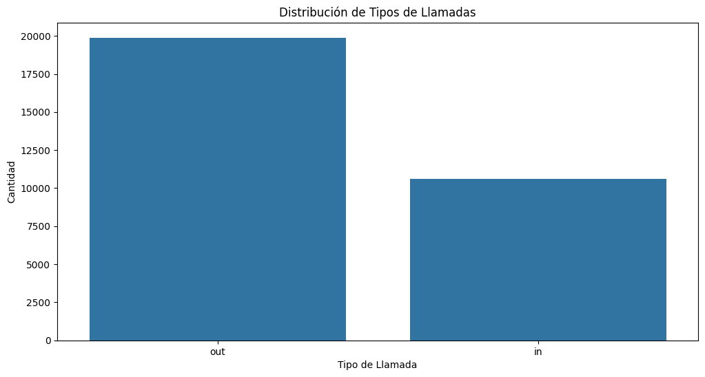
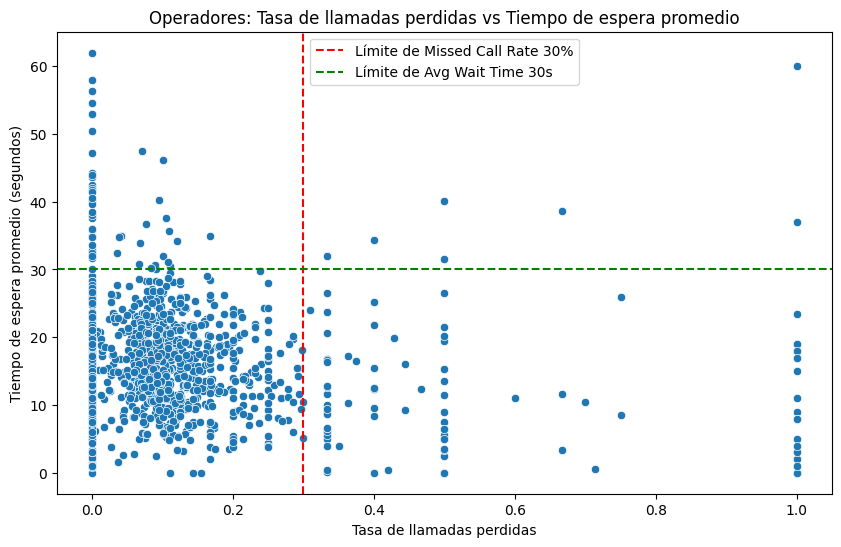

## Sobre mí

Tecnóloga en gestión hotelera con 4 años de experiencia en atención al cliente digital, apasionada por el análisis de datos y la visualización de información.  
Me formé como Data Analyst en TripleTen Bootcamp. Actualmente estoy en busca de nuevas oportunidades laborales en este campo.

## Lenguajes y herramientas

Competencias
Atención al detalle | Pensamiento analítico | Resolución de problemas | Organización | Adaptabilidad | Comunicación clara | Aprendizaje autónomo | Trabajo en equipo | Orientación a resultados | Gestión del tiempo

# Modelo de predicción de perdidas de clientes

Análisis de comportamiento de clientes de un gimnasio para segmentarlos en grupos y mejorar la retención a través de estrategias personalizadas.

## Objetivo
Agrupar a los clientes según su frecuencia de uso, edad, gastos y tipo de contrato para entender patrones de cancelación (churn) y fidelización.
  
## Herramientas y tecnologías
- Python (Pandas, Matplotlib, Seaborn)
- Scikit-learn: KMeans
- Visualización: KDE plots, boxplots
- Análisis de clústeres y churn

## Proceso
- Limpieza de datos y escalado de variables
- Aplicación de K-Means con 5 clústeres
- Análisis de cada grupo según sus características
- Recomendaciones por segmento

## Conclusiones
- Se identificaron grupos con alto riesgo de abandono
- Se propusieron acciones por clúster (contratos largos, promociones, fidelización)
- Visualizaciones claras del perfil de cada grupo
    

**Puedes ver el proyecto completo [aqui](https://github.com/meli6432/Modelo-de-predicci-n-de-perdidas-de-clientes).**

# Identificación y clasificación de operadores ineficaces

Este proyecto analiza el rendimiento de operadores telefónicos en una empresa de telecomunicaciones, con el objetivo de identificar perfiles ineficaces y proponer mejoras.

## Objetivo
Detectar operadores con alto porcentaje de llamadas perdidas y largos tiempos de espera utilizando análisis exploratorio y modelos predictivos.
 

## Tecnologías y herramientas
- Python (Pandas, Matplotlib, Seaborn)
- Scikit-learn (RandomForest, LogisticRegression)
- Tableau (para visualización final)
- Pruebas estadísticas (Mann-Whitney)

## Lo que se hizo
- Limpieza y análisis de datos históricos de llamadas
- Cálculo de KPIs: `missed_call_rate`, `avg_wait_time`, `outgoing_calls`
- Etiquetado de operadores ineficaces
- Entrenamiento de modelos predictivos
- Visualización de insights clave en Tableau

## Resultados
- Modelo Random Forest con precisión >85%
- Ranking de importancia de variables
- Recomendaciones prácticas para supervisores

 

**Puedes ver el proyecto completo [aqui](https://github.com/meli6432/operadores-telefonicos-ineficaces).**

¡Gracias por tomarte el tiempo de conocer mi trabajo!

💬 Si quieres conectar, intercambiar ideas o explorar posibles colaboraciones, estoy disponible en:

🔗 [LinkedIn – Sandra Vidal Jaramillo](https://www.linkedin.com/in/sandra-vidal-j/)
📧 meli6432@gmail.com
📍 Colombia | Disponible para trabajo remoto
